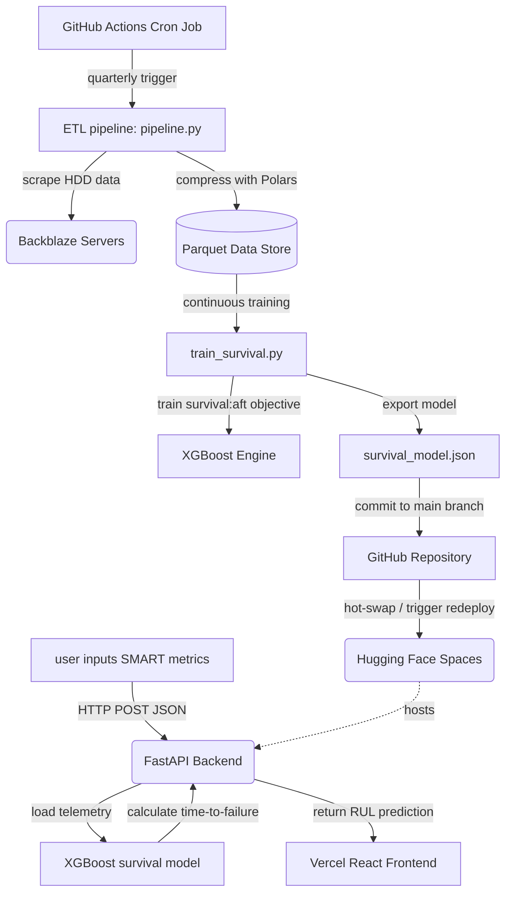

> **warning:** the YAML metadata block at the very top of this file is absolutely required for hugging face deployment. it configures the docker SDK and binds the container to port 7860. do not remove it!

# data center guardian

an enterprise-grade predictive maintenance MLOps platform focused on forecasting HDD remaining useful life (RUL) using survival analysis on the backblaze hard drive dataset.

## project overview

in massive hyperscale data centers, hard drive failures are an inevitability, not a possibility. waiting for a drive to fail before replacing it results in data degradation and emergency maintenance costs. data center guardian solves this by actively monitoring the SMART telemetry of hard drives and using an advanced machine learning model to predict exactly how many days a drive has left before catastrophic failure.

by predicting the time-to-failure (TTF), data center operators can perform proactive, scheduled maintenance, saving thousands of dollars in emergency operational overhead.

## key features

- **real-time RUL prediction:** input live SMART telemetry to instantly receive an estimated time-to-failure (TTF) in days.
- **decoupled microservice architecture:** frontend UI hosted on the vercel edge network, backend inference API hosted on hugging face spaces.
- **survival analysis:** utilizes xgboost trained with an accelerated failure time (`survival:aft`) objective to handle right-censored data accurately.
- **continuous training (CT) pipeline:** a fully automated CI/CD pipeline powered by github actions that scrapes new quarterly backblaze datasets, retrains the model natively, and hot-swaps the production weights.
- **zero-cost deployment:** architected to leverage free tiers of vercel and hugging face for an enterprise-level platform with zero infrastructure costs.

## tech stack

### frontend UI
- **vite & react:** blazing fast compilation and modern UI components.
- **typescript:** strict type-safety for enterprise reliability.
- **vanilla CSS:** custom design system without bloated frameworks.
- **vercel:** globally distributed edge network deployment.

### backend API
- **fastapi:** high-performance python API framework.
- **xgboost:** native gradient boosting framework utilizing the `hist` tree method.
- **polars:** ultra-fast dataframe library written in rust for memory-efficient ETL operations.
- **docker:** containerized inference environment.
- **hugging face spaces:** serverless ML hosting environment.

### MLOps
- **github actions:** automated ETL, training, and deployment triggers.
- **backblaze dataset:** dynamic scraping of real-world HDD failure datasets.

## detailed architecture



the platform is split into three distinct, highly decoupled operational domains.

### 1. the client (vercel)
the user interfaces with a lightweight react dashboard. the frontend is completely "dumb"—it performs zero math. when a user inputs SMART metrics (such as `smart_5_raw`, `smart_187_raw`, etc.) and clicks "run prediction", the client constructs a JSON payload and fires an HTTP POST request across the internet to the backend.

### 2. the inference engine (hugging face spaces)
hugging face hosts our custom docker container running a fastapi python server. the server listens on port 7860. when it receives the JSON payload, it feeds the data into the globally loaded xgboost `.json` model, calculates the RUL, and sends the response back to the client. it is configured with strict CORS policies to only accept traffic from our designated frontend.

### 3. the MLOps pipeline (github actions)
machine learning models experience "data drift" as hardware ages. to combat this, we implemented continuous training (CT). a github action is scheduled via cron to spin up every quarter. it runs a python ETL pipeline (`pipeline.py`) that reaches out to the backblaze servers, downloads the newest CSV quarterly data, compresses it into a parquet file using polars, and feeds it to `train_survival.py`. the updated `survival_model.json` artifact is then automatically committed back to the `main` branch by a github bot, triggering a hot-reload on hugging face.

## the machine learning approach

standard binary classification (will it fail? yes/no) is insufficient for predictive maintenance because it doesn't tell operators *when* to replace the drive. standard regression is also flawed because it cannot handle "right-censored" data (drives that are currently healthy but will eventually fail in the unknown future).

to solve this, we utilize **survival analysis**. specifically, we train an xgboost model using the `survival:aft` (accelerated failure time) objective. this allows the model to correctly interpret the lifespan of healthy drives and calculate a continuous timeline for failure.

## installation & local development

if you want to run the platform locally on your own machine:

1. **clone the repository:**
   ```bash
   git clone https://github.com/bettercallok/data-center-gaurdian.git
   cd data-center-guardian
   ```

2. **setup the backend environment:**
   ```bash
   python -m venv venv
   source venv/bin/activate
   pip install -r requirements.txt
   ```

3. **run the local API server:**
   ```bash
   uvicorn src.api.main:app --host 0.0.0.0 --port 8000 --reload
   ```

4. **run the local frontend server:**
   open a new terminal window:
   ```bash
   cd frontend
   npm install
   npm run dev
   ```

## automated deployment

### backend (hugging face)
1. create a new hugging face space and select the "docker" SDK.
2. click "sync with a github repository" and point it to this repo.
3. hugging face will automatically read the YAML metadata at the top of this readme, build the `Dockerfile`, and expose port 7860.

### frontend (vercel)
1. log into vercel and click "import project".
2. select this repository from your github account.
3. change the **root directory** to `frontend`.
4. ensure the framework preset is set to `vite`.
5. click deploy.
